# ETL

ETL process to read in a MariaDb ‘slow query log’.

## Introduction

We use a MariaDb at work, which is a split from MySql.  

Like everything to do with MariaDb / MySql there’s lots of badly documented half baked solutions which you cobble together so you can achieve something and trying
to ‘optimise’ is one of those things.  I’ve been given this task, but no one really know what ‘optimise’ means or how we might measure it.

MariaDb writes an entry into a ‘slow query log’ if a query takes more than a certain threshold.  The file size for
our log for a database that is not really that busy is 7GB.  The network admin uses mysterious script to summarise the raw data but I decide to load the ‘slow query log’ itself to perform some analysis that way.

## Visual Studio Solution

I created a Visual Studio Solution with two projects:

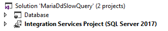

1. A database project to hold the staging table and results.
2. A SSIS project to move the data into the database project.

### Database Project

This is not about Database Projects per se, but I can really recommend considering them.  You can put your databases into source control and all those other good things that come with that.
In this project, I’ve created two schemas, one to hold the staging tables and stored procedure, and one to hold the results.

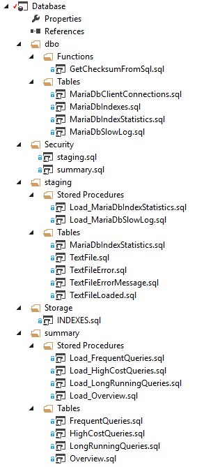

#### Text File Table

The first table is to read in the text file.  I need to the automatically generated line numbers to make sure I keep the order when reading the lines out of the table.

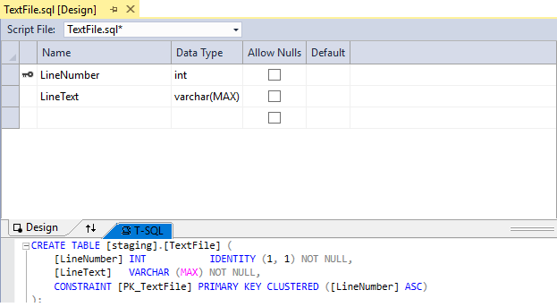

#### Slow Queries Table

The second table stores the process rows from the Text File table.  I’ve created a **checksum** as a persisted calculated column
so I can group similar queries.  I’m taking the checksum of the **SELECT** and **FROM** clauses.  This has the affect
of removing **USE** statements and everything from the **WHERE** onwards.  If the **SELECT** and the **FROM** (include the **JOIN**s) are the same, I’m assuming it’s the same query.  There’s room for improvement here, but it’s a start.

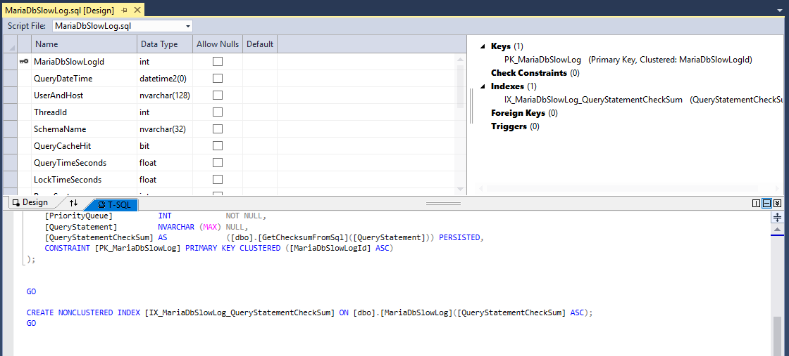

### SSIS

The SSIS project has a single package to read in the text file.

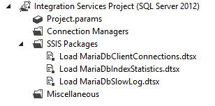

#### Control Flow

The control flow clears the staging table, loops through all log files in a temp directory and loads each file into the staging table.  The stored procedure processes the staging table and loads the results into the result table.

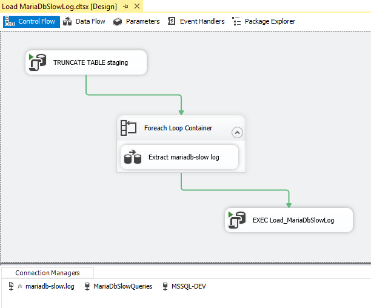

#### Data Flow

No magic here... reading a text file into a table.

#### Stored Procedure

I’ve included the source code to the stored procedure in this repository.

## Results

This is what it looks like in action.

### Text File Table

You can see the text file has been loaded with row numbers with the following structure:

1. Header lines starting with #
2. *n* lines for the query, not starting with a #

The stored procedure loops through the lines and does this:

1. Read in the header lines (the ones starting with a #) and concatenate them (to make the text-split easier)
2. Build the sql statement by looping until I find a line with a #, i.e. the next block
3. Insert values into the table

This the log file after it’s read into the FileText table.

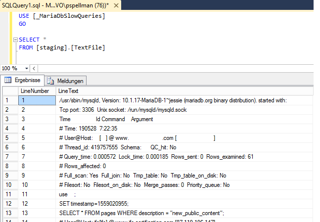

And this is what the final result looks like after the stored procedure has run:

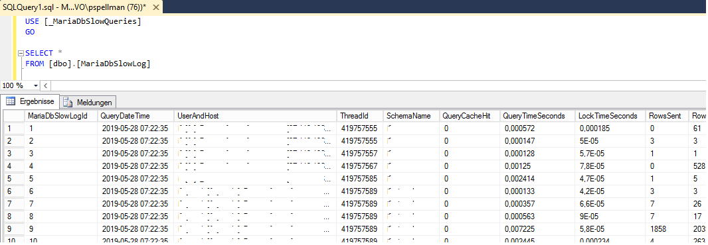

Now we can query the table to find out lot’s of interesting things.  Time to harness the power of Power BI.

## Power BI

Here’s a report I through together.  Beats a text file, processed or unprocessed, is a starting point for us to find out where the pain points are.

### Database Load

This shows basic load on the database.  Top graphs shows the number of queries, the bottom graph shows the number of rows being returned.  We can see the sync running every half an hour.  You can also click on the graph and it will show the queries running at that time point.

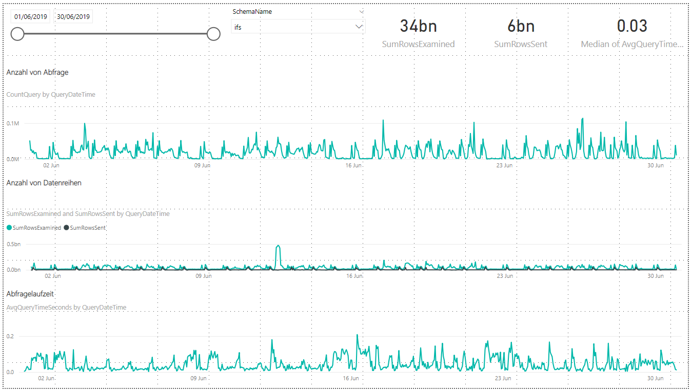

### Client Connections

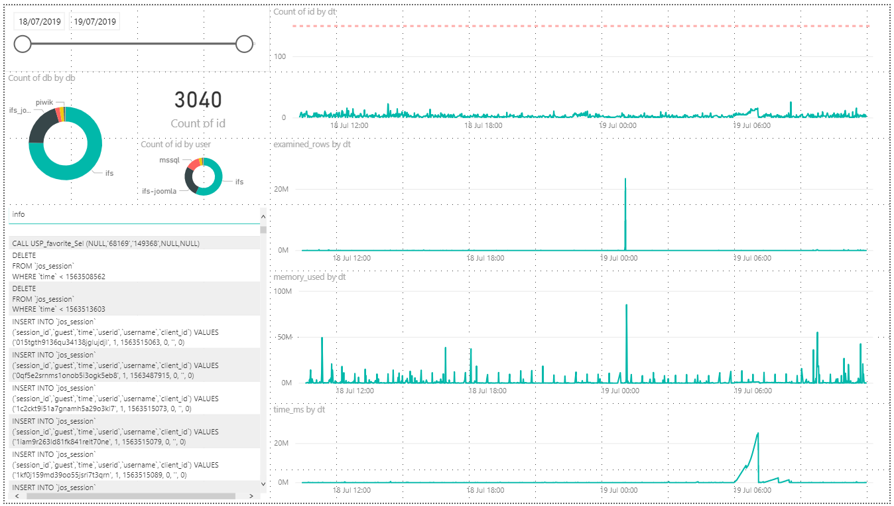

### High Cost Queries

This shows the quick wins.  “High Cost” is defined as the gap between the number of rows examined vs. the number of rows return, i.e. those queries that could benefit from an index.  I’ve then multiplied this difference by the number of times the query ran to get a listing.  You can see a couple of queries that are really crying out for some love.

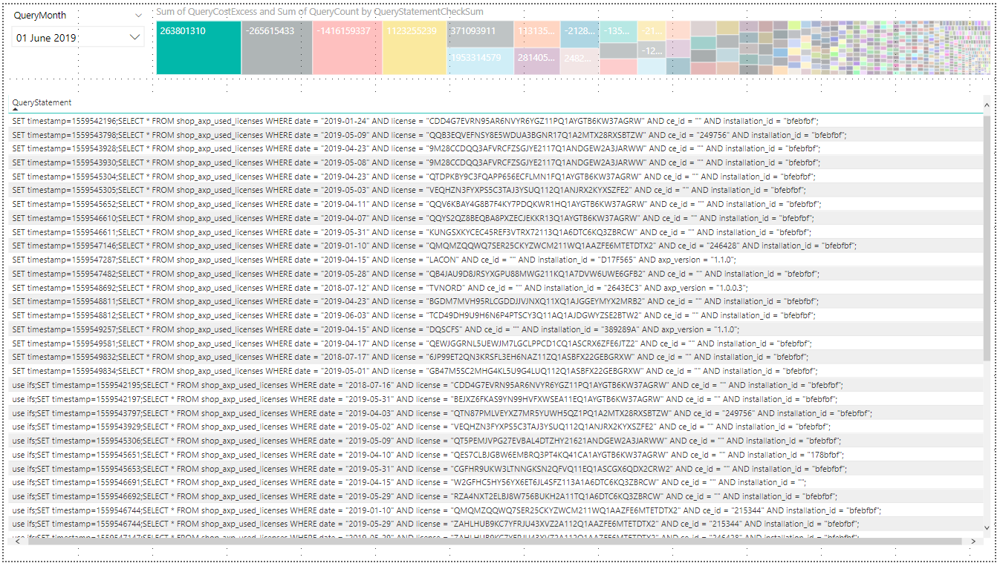

### Long Running Queries

Basically a listing of queries by running time.  You can then decide if the running time’s acceptable for what the query’s doing, i.e. backup jobs are at the top of the list.

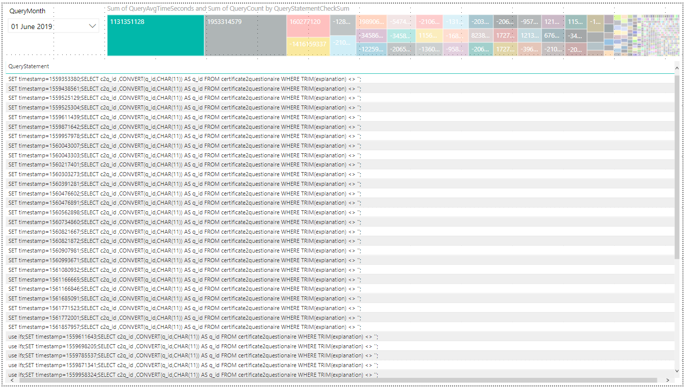

### Common Queries

Basically a listing of queries by the number of times executed.  These are queries that the developers need to do something about.  The query at the top of the list sometimes runs more that 100 times a second.  We need to ask if that’s really necessary.  

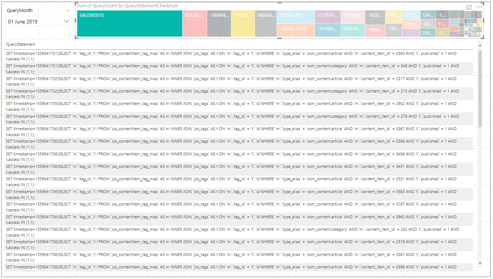

### Index Usage

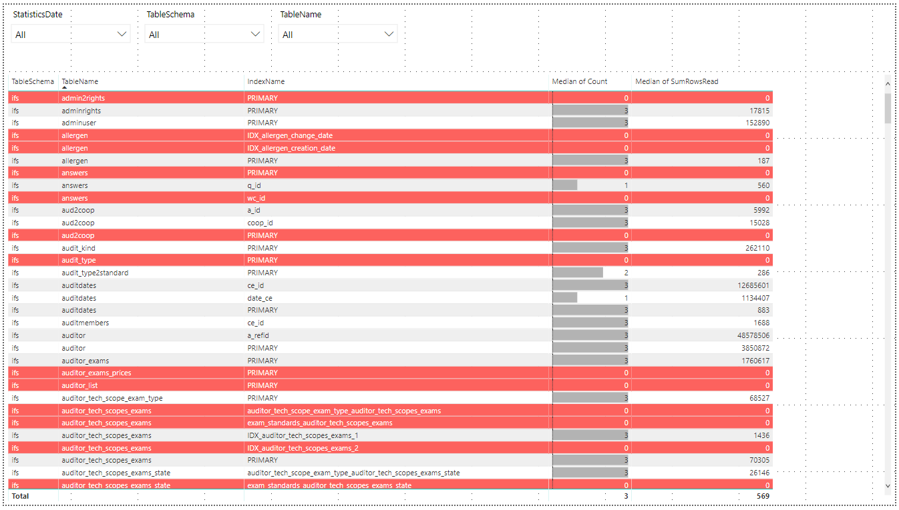

## Conclusion

With a bit of work and investment we achieved insight to the performance of our unloved MariaDb.  We can present our findings in a highly visual way that everyone can understand thanks to Power BI, we have actionable results and can measure the improvement over time.
