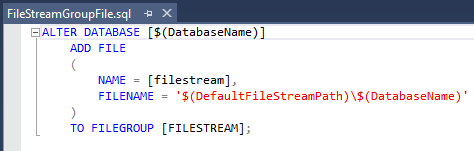

# Visual Studio Database Project With FileStream

This document describes how to include FileStream in a Visual Studio Database Project.  It’s
not a copy of the MSDN page, but what you really need to do to get things working.

This assumes you’ve enabled the server for FILESTREAM.

## Create FILESTREAM file group

This first thing you need to do is add the FileStream Group and associated file.

This is straight forward and just like adding a ‛normal’ table.

Notice you can use a variable to set the path.  You can add the variable to the project in the SQLCMD Variables tab.  This
might be interesting if you’re deploying to different environments.  You can set a default value if
you don’t want to type it in everytime.  I’ve also added the name of database to the name so if you
change the name of the database, the name of the FileStream Group changes automatically too.  It
avoids clashes if you have more than one FileStream enabled database on a server.

## Set database settings

Now comes the tricky part!  Open up the project settings and open the database settings.

If you’ve added the FileStream group correctly, you can set on the **Operational** tab.

You can change the settings for the FileStream itself on the **Miscellaneous**.  Don’t bother to set the
directory name: it doesn’t seem to work.

What you need to do instead is create a post deploy script.  In this script you can
set up the FileStream.  You need to add the IF clause, otherwise
every time you publish, it will try and add another FileStream to the database.  Notice
you can set the path dynamically here.

Another thing I always recommend is to change the owner of the database.  It’s one
of the those things that no one does, but you have the feeling you should,
but it doesn’t seem to really matter either way.

## Add table

Now you can add a FileStream table in your project just like you would any
other table (or any other type of object for that matter).

## Publish

And when it comes to publishing the database, you can set the database name dynamically, click on **Load Values**
to get the default path, and you’re good to go.

