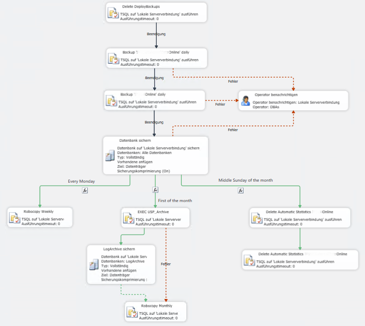
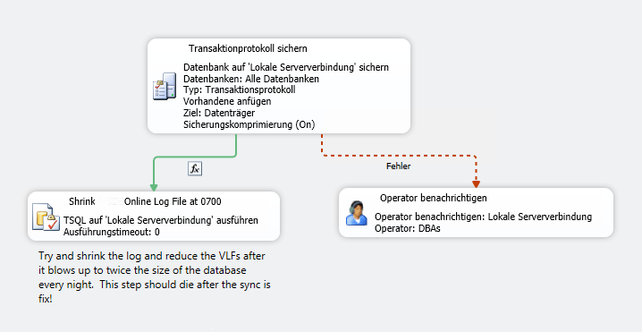
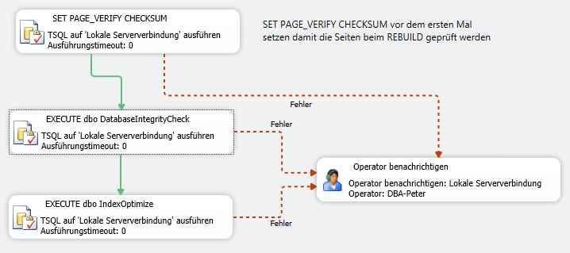
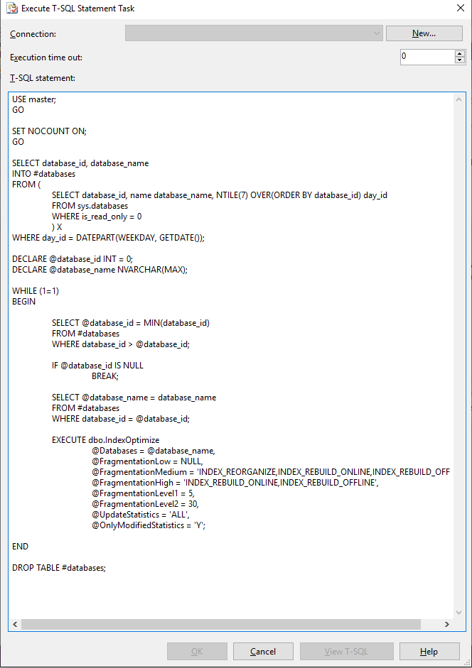

# Maintenance Task

Even though it’s not regarded as cool, I like to use the Maintenance Tasks in SQL Server.  It provides a nice visual representation
of what’s happening.  It’s saved as a Integration Services Package, so you can use Management Studio to export
and import it to another server.

I put this together at a client.  They were only backing up two of their databases.  One was set to the ’Full’ recovery model,
but no log backups were being made.  The databases had never been checked nor the indexes optimised.

## Schedule

I’ve split the Maintenance Task into several sub-tasks which run throughout the day.

## Full Backup

### Steps

* Delete Deploy Backups: This jobs deletes all files in a directory which is used by a Visual Studio Database Project to
deploy datbases.  The deploy file is often forgotten and sometimes quite large.

* Backup X_Online Daily : These two steps are a copy of a SQL Server Agent job which backs up a particular database.  I’ve integrated this job into the maintenance task so all steps are together a as a transition step.  When we’re sure
the maintenance task is working, we’ll delete these two steps.

* Datenback Sichern (Backup Databases): This is the standard backup task to backup *all* databases to a local ’Daily’ folder.

* Every Monday
  * Robocopy Weekly: Every Monday the two most important databases are copied to an additional ’Weekly’ folder.  

* Every 1st of Month
  * EXEC USP_Archive and ’LogArchive sichern’ (Backup LogArchive): These two steps archive database email.  The application sends
  all emails using database email, so the msdb database is quite large.
  * RoboCopy Monthly: The two most important databases are ’archived’ to a remote NAS.

* Every Middle Sunday of the month: The condition for this branch ensures that it runs on a Sunday morning in the middle of
the month (day 15 ± 3 days).  It deletes all automatically generated statistics.  While SQL Server creates statistics it needs,
it never deletes them, leading to bloat over time.  If it need statistics which have been deleted, it just recreates them, which is why this runs on a Sunday (low load on the database) in the middle of month (no reporting, etc.).
  * Delete Automatic Statistics X
  * Delete Automatic Statistics Y

## Cleanup

The clean up removes backup files and job histories, but checks first if there are recent backups!  If there are
no recent backups, i.e. backups with in the last hour, it sends a warning email.

## Transaction Log Backup

This subtask runs every 10 minutes to backup the log file for the databases with the FULL backup model.  The
additional step resizes the log file of the main database once a day.  This is normally bad (!!), but
due to a badly written sync job, the log file is sometimes grows to larger than the database file with
hundreds of Virtual Log Files.  Hopefully I can get the rewrite of the job into production soon
and remove this ugly step.

## Index Optimisation

This subtask runs Ola Hallengren’s dbo.DatabaseIntegrityCheck and dbo.IndexOptimize.  I used a non-blocking
loop to make sure the each database gets checked once a week.  The step SET PAGE_VERIFY CHECKSUM sets
all database to Page Verify Checksum since some developers set this to NONE in the hope of ’optimising’
performance.  I’ve now set up a Database Policy to enforce this.

## Rebuild All Indexes

This is a once-off subtasks to rebuild every single index in the database to ensure data consistency after
Page Verify was set to none for this database.