# Data Warehouse Power BI

This is a proof-of-concept for a reporting solution.  

## Visual Studio Data Project

I’ve mentioned this before, but I’m really a fan of the Visual Studio Data Projects.  You
can keep your database “source code” in Visual Studio which allows all those good things
like version control and a much more professional rollout process.

Here are the projects I created.  A simple database warehouse schema and an SSIS project
for the ETL.

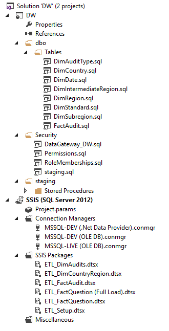

## Fact Table Design

Since I’m demonstrating the technology there are only two fact tables, the more interesting
is the FactAudit table.

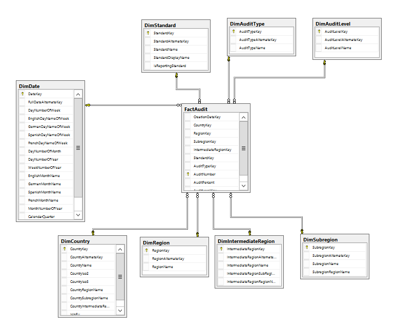

## ETL

### Slow Changing Dimension Table Load

Loading the dimension tables is easy thanks to the SSIS wizard which does all the
thinking for me.

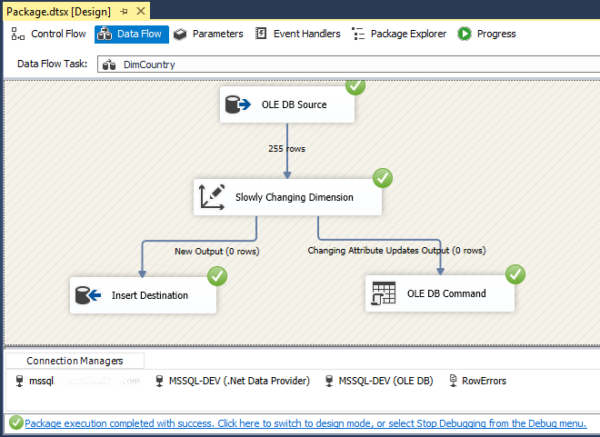

### Fact Table Load

Here I had to do some leg work.  I wrote a fancy pants queries to get the data directly how I wanted it, i.e.
skipped the ”staging” part, and then matched the keys for all the look ups.  Then I loaded the fact table.  It’s
cheating a bit to just truncate the table and load the whole thing every night.  

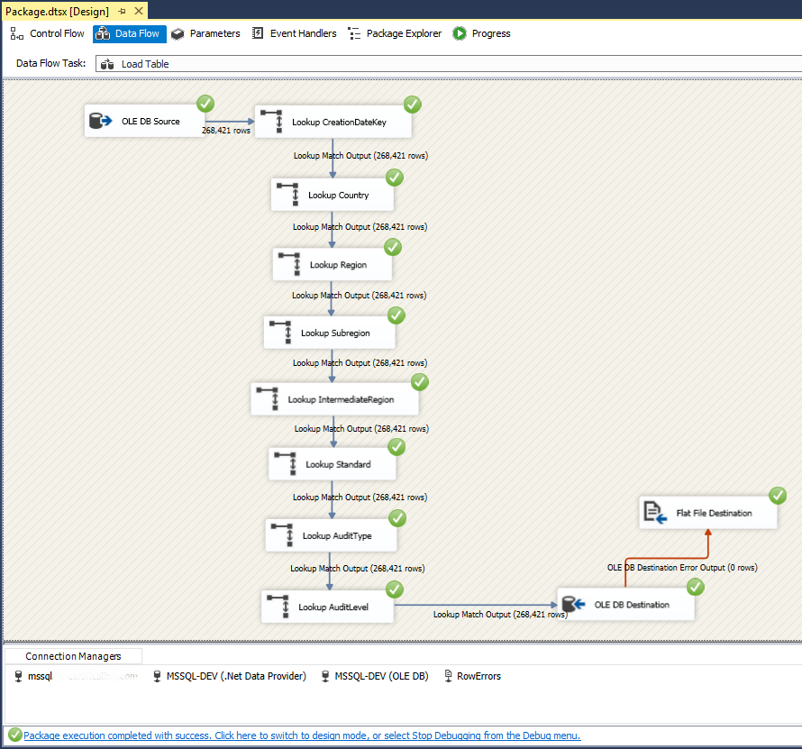

This is what the data flow looks like.

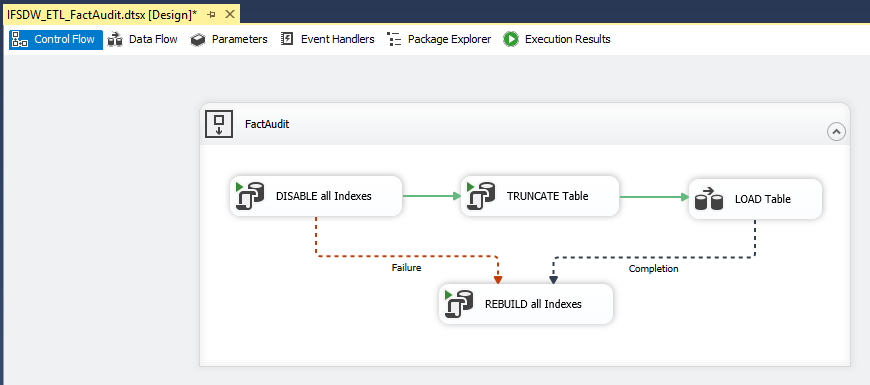

### Fact Table Partial Load

The second table I added was too big to TRUNCATE / Load every night, so I need to implement a partial load strategy.

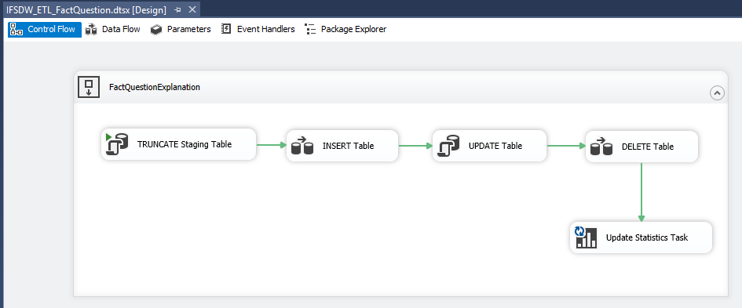

The four steps are

1. Load all the changes to the original table into a staging table.  The original table has a change date
column which I can use so I can load only what I need

2. I can then use the primary key to check whether I have the rows in my Data Warehouse table and if not, import them.

3. I can cheat again and just use a SQL statement for the updates.  Notice the WHERE clause, I don’t want to fill up my database
log with useless updates.
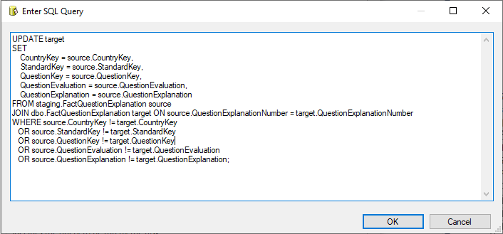

4. The delete works the same way.  I can get a complete list of the primary keys from the source to use as my lookup list.  If
I have values in my Data Warehouse table that aren’t in this lookup list, I need to delete them.

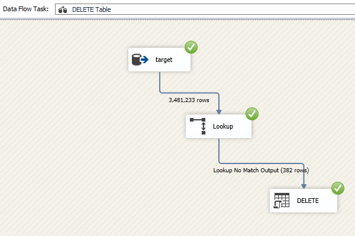

### SQL Server Agent Job

And the job runs every morning

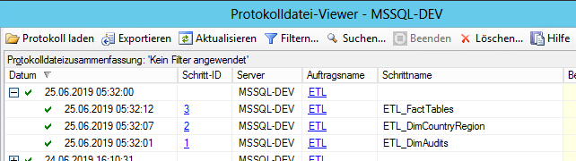

## Power BI

Since the client is still scared of the cloud, I’m using the on premise data gateway.  I’m impressed.  The reaction time is great
and you would never know that the database is hosted locally.  It was also a breeze setting it up.

### On-premise Data Gateway

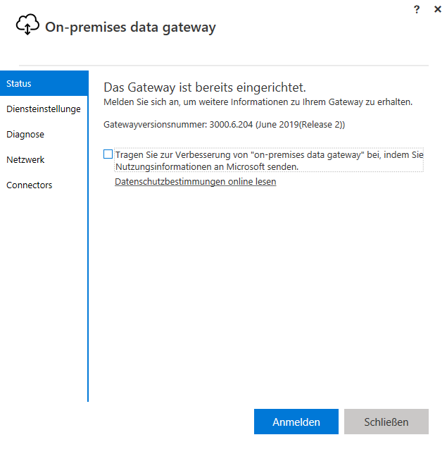

### Report

This is the report I created.  The goal is to enable the end users to pull basic statistics based on the some filtering.

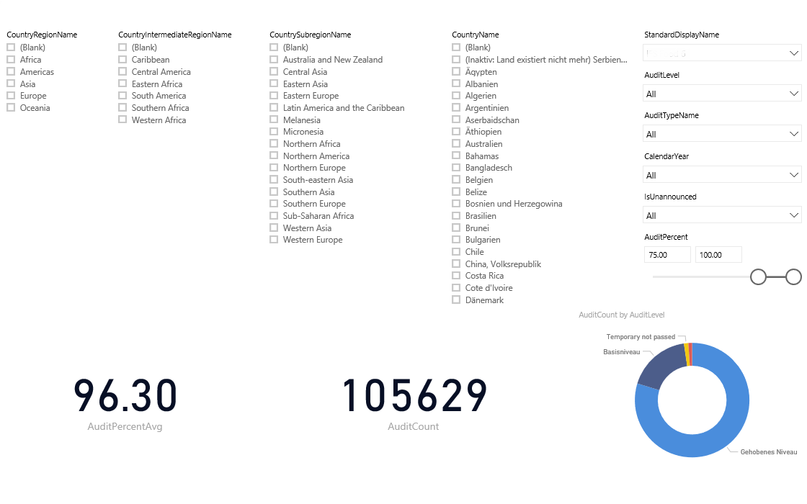

Since every presentation I’ve ever been too for Power BI has this world map, I’ve
included it too.  I’m trying to inspire the client to show them what’s possible.

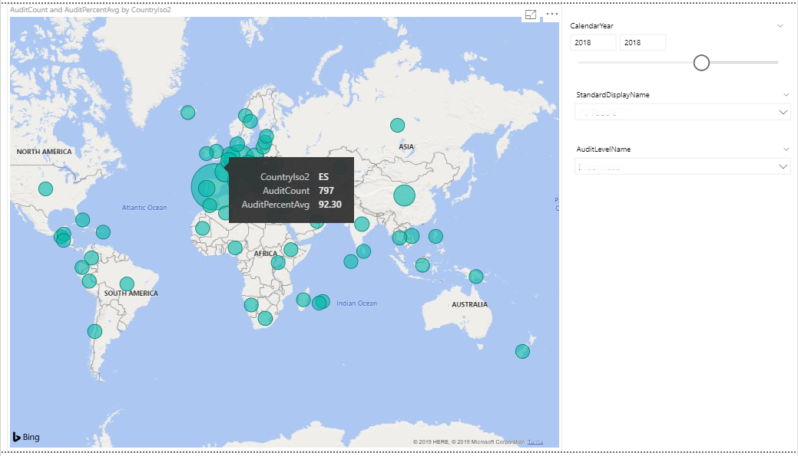

## Conclusion

This project puts together all elements we need for a reporting solution.
