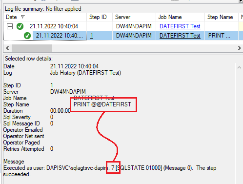

Today I debugged a stored procedure which wasn’t producing the right results on Monday morning.   When we ran it locally, there wasn’t a problem.  Looking through the proc, I noticed that the developer was calculating values according to weeks.  This is always dangerous because first days of the week vary across the world.  You notice this using an American product in Europe.  In Europe the first day of the week is Monday, in America it’s Sunday.

We can see this if we try this using the default values in SQL Server:


```sql
SELECT ’Monday’
WHERE DATEPART(WEEKDAY, GETDATE()) = 1;  -- This won’t run on a Monday
```

We have to explicitly set which day we want as the first day of the week, so our date calculations return the results we expect.

```sql
SET DATEFIRST 1;

SELECT ’Monday’
WHERE DATEPART(WEEKDAY, GETDATE()) = 1;  -- This will run on a Monday
```

To confirm, I ran a job in SQL Server Agent:




And there we have it.  The first day of the week for SQL Server Agent is Sunday.  The solution was explicitly  setting ```DATEFIRST``` in the stored procedure.


Things to remember:
* SQL Server Agent Job might have different environment settings to you

