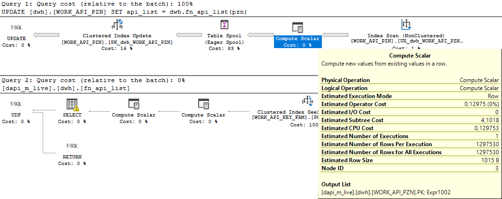
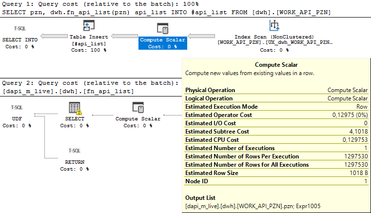
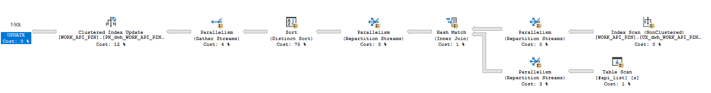

Today I looked at a stored procedure to see if I could get it to run faster.  In a multi-statement stored procedure improving each statement a little may have a worthwhile effect on the run time overall, especially if it runs several times a day.  

I found this statement in the stored proc which took five minutes to run.

```sql
UPDATE [dwh].[WORK_API_PZN]
SET api_list = dwh.fn_api_list(pzn);
```

Here's the execution plan.  The table's only a million rows, but the scalar function is also called a million times.



Here are the statistics:

```
Table 'Worktable'. logical reads 3832828
Table 'WORK_API_PZN'. logical reads 3977143
CPU time = 287828 ms,  elapsed time = 289649 ms.
```

Oh no, CPU time is the same as elapsed time, meaning it didn't go multi-threaded.  Looking at the execution plan, the multi-threading symbols are indeed missing.  Why didn't it go multi-threaded, when I was well above the threashold? 

Then I remembered some long ignored factoid: Queries with scalar functions stay single threaded.  This was supposedly improved in SQL Server 2019, but since we're on SQL Server 2019, it looks like not in this situation.

Could we restructure the query?

Let's try inserting the result of the scalar function into a temporary table.  You expect that it would take about half the time, but strangely it took only a third.  That's a good start!


```sql
SELECT pzn, dwh.fn_api_list(pzn) api_list 
INTO #api_list 
FROM [dwh].[WORK_API_PZN];

```

```
Table '#api_list'. logical reads 1304320
Table 'WORK_API_PZN'. logical reads 3452
CPU time = 104766 ms,  elapsed time = 106040 ms.
```

Now let's join on the column which uniquely identifies the row.  I didn't put a _primary key_ on the temporary table since I assumed the optimiser would do a table scan anyway, so it wasn't worth the effort.  

```sql
UPDATE y
SET api_list = x.api_list
FROM #api_list x
JOIN [dwh].[WORK_API_PZN] y ON x.pzn = y.pzn;

DROP TABLE #api_list
```

```
Table '#api_list'. logical reads 6379
Table 'WORK_API_PZN'. logical reads 3977213
CPU time = 6906 ms,  elapsed time = 3379 ms.
```

That looks better: At least some of the query went multi-threaded.  Inserts and updates are single threaded as well.

In conclusion, we have to read the million rows, and we have to write a million rows, but we managed a real world improvement of about half.  

Just as an aside, SQL Server 'recycles' temporary tables, including the statistics, so you might need to consider this if calling your stored procedure or script within short intervals.  

Things to remember:
* Scalar functions are single threaded

