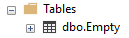
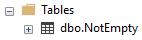

When youʼre using ```sp_rename``` in your scripts, you can be clever
and use square brackets for the ```@oldname``` parameter, but
you can't use them for the ```@newname``` parameter, unless you
want the square bracket to part of the name.

## What you have



## What you don't want

```sql
EXEC sp_rename  @objname = '[dbo].[Empty]', @newname = '[dbo].[NotEmpty]'
```


## What you do want

```sql
EXEC sp_rename  @objname = '[dbo].[Empty]', @newname = 'Empty'
```

